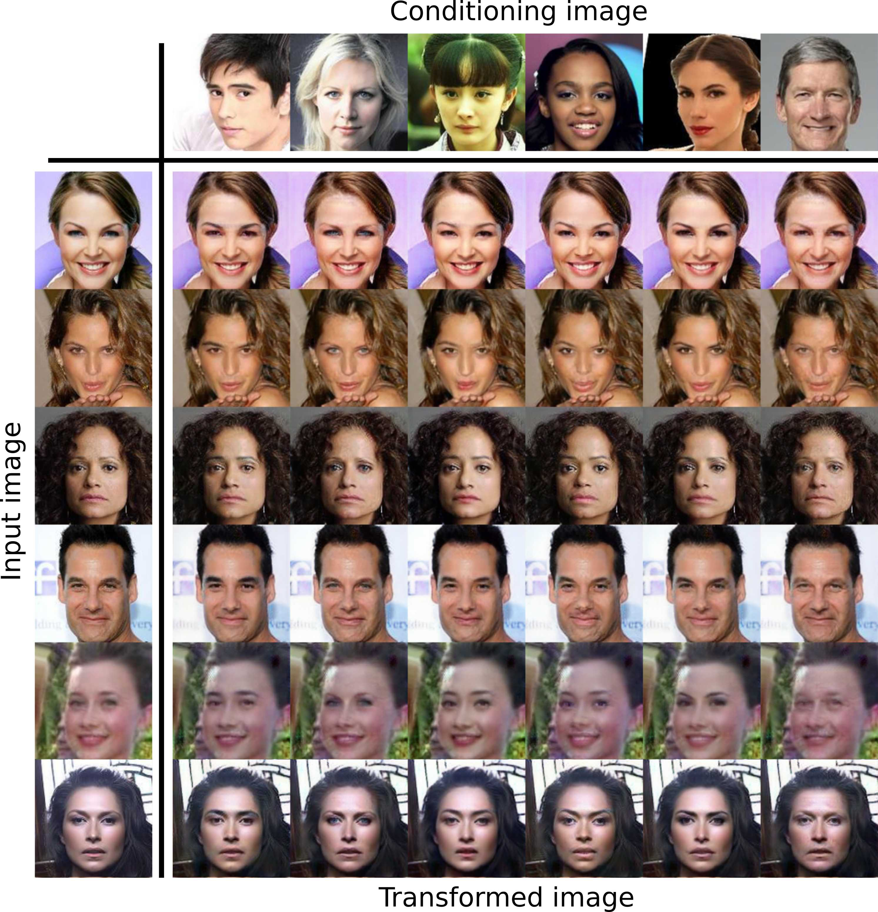

# [WIP] Identity-conditioned Face Transformations Using Generative Adversarial Networks

<small aling="center">Source: original report.</small>

## Introduction
This GAN receives two images

- input image `A`, and
- conditioning image `B`.

The output is a transformation of `A` in which some characteristics of the identity of `B` have been included.

## TODO

- [x] Implement main training loop
- [ ] Validation
- [ ] Better configuration
- [ ] Scorer for tensorboard
- [ ] Long training
- [ ] Clean unused code from StarGAN

## Technical report
This repository contains an implementation of the system proposed in
_Identity-conditioned Face Transformations Using Generative Adversarial
Networks_. The original work has been done during an internship in Fujitsu
Laboratories LTD Japan as part of the [_Vulcanus in Japan_](https://www.eu-japan.eu/events/vulcanus-japan) programme and presented at [Swopp 2018](https://sites.google.com/site/swoppweb/).

    Nuevo Castro, G., Kasagi, A., Yamazaki, M., Tabaru, T. and Ike, A. (2018).
    Identity-conditioned Face Transformations Using Generative Adversarial Networks.
    In: SWoPP. [online] Available at: https://sites.google.com/site/swoppweb/.
